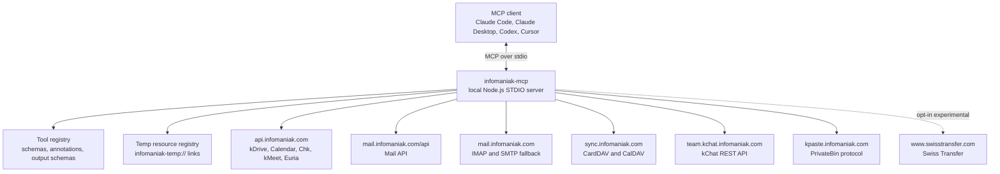
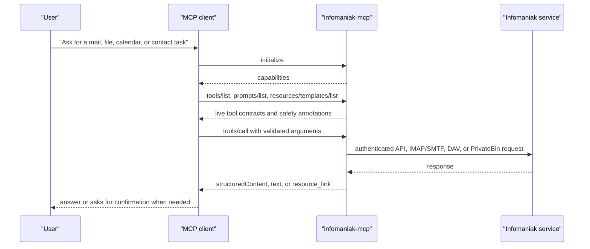
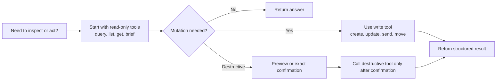

# Infomaniak kSuite MCP Server

A unified [Model Context Protocol (MCP)](https://modelcontextprotocol.io/) server that gives AI agents full access to your Infomaniak kSuite ecosystem. One server, one config — stable tools for kDrive, Calendar, Mail, Contacts, kChat, kMeet, Chk, and kPaste, plus optional AI tools and experimental Swiss Transfer support.

All data stays on Swiss infrastructure. Your credentials never leave your machine.

## User vs Admin Scope

This MCP is for **end-user productivity inside one user's kSuite**: mail, kDrive files, calendars, contacts, tasks, kChat conversations, kMeet rooms, Chk links, kPaste, and optional Euria AI.

For tenant/account administration, use the admin-focused companion repo: [`infomaniak-admin-mcp`](https://github.com/Mogacode-ma/infomaniak-mcp-agent). That project is meant for administrator workflows such as account governance, hosting, domains/DNS, mail administration/security, kDrive and kChat governance, API coverage audits, and stricter two-phase commit operations.

The split is intentional. If a workflow changes settings for other users, domains, hosting, organization-wide mail security, or account-level governance, it belongs in `infomaniak-admin-mcp`, not this user MCP.

## 1.0 Launch Status

`@henrikogard/infomaniak-mcp` is versioned as `1.0.0` and the default advertised surface is the stable, user-scoped MCP server. Experimental Swiss Transfer tools are hidden unless `ENABLE_EXPERIMENTAL_SWISSTRANSFER=1` is set.

Launch-readiness docs:

| Document | Purpose |
|----------|---------|
| [Architecture](./docs/ARCHITECTURE.md) | Runtime topology, startup flow, tool-call lifecycle, mail routing, safety, and resource-link design |
| [1.0 Release Checklist](./docs/RELEASE_1_0.md) | Release scope, verification commands, smoke-test levels, known caveats, and publish checklist |
| [Swiss Transfer Experimental Notes](./docs/SWISSTRANSFER_EXPERIMENTAL.md) | Details for the opt-in Swiss Transfer flow |

## Services

| Service | Protocol | Tools | Description |
|---------|----------|-------|-------------|
| **kDrive** | REST API | 26 | Cloud storage — files plus share links, versions, trash restore, comments, recents, activity, and cursor-style pages |
| **Calendar** | REST API | 5 | Calendar management — list, create, update, delete events with recurrence and reminders |
| **Tasks** | CalDAV | 8 | Task management — list, search, view, create, update, complete, delete VTODO tasks |
| **Mail** | Mail API + IMAP/SMTP fallback | 26 | Email — query/list mailboxes, metadata-first reads, search, send, drafts, folder management, bulk cleanup, spam cleanup, filters, attachments, API-backed move/delete/flag |
| **Contacts** | CardDAV | 8 | Address book — fast query, list, search, get, create, update, delete contacts with multiple emails/phones |
| **AI Tools (Euria)** | REST API | 4 | Sovereign Swiss AI — chat, embeddings, audio transcription |
| **Swiss Transfer** | REST API | 2 experimental | Encrypted file sharing up to 50 GB (disabled by default) |
| **kChat** | REST API | 9 | Team chat — channels, posts, threads, reactions, users, and direct messages |
| **kMeet** | REST API | 3 | Video conferencing room management |
| **Chk** | REST API | 4 | URL shortener with QR codes and cursor-style pages |
| **kPaste** | PrivateBin | 2 | Zero-knowledge encrypted secret sharing with confirmed local decrypt |
| **Workflow tools** | MCP composition | 4 | Read-only aggregate tools for mail triage, sender cleanup planning, meeting briefs, and recent kDrive context |
| **MCP Help** | MCP metadata | 1 | Self-describing capability guide for the currently advertised tools and safe workflows |

## Capability Matrix

| Service | Read | Write | Notes |
|---------|------|-------|-------|
| kDrive | Yes | Yes | Files plus share links, versions, trash restore, comments, recents, and activity |
| Calendar | Yes | Yes | Event CRUD via Infomaniak REST API, including RRULE recurrence and reminder offsets |
| Tasks | Yes | Yes | VTODO CRUD via CalDAV |
| Mail | Yes | Yes | API-backed query/list/read/search/send, drafts, folder management, sender bulk cleanup, spam cleanup, filters, and single-message move/delete/flag when `MAIL_TOKEN` or `INFOMANIAK_TOKEN` has `workspace:mail`; IMAP/SMTP fallback covers attachment download/sending, draft attachments, folder fallback, and full-body search |
| Contacts | Yes | Yes | Contact CRUD via CardDAV with multiple email and phone fields |
| AI Tools (Euria) | N/A | N/A | Stateless model calls: chat, embeddings, transcription |
| Swiss Transfer | Partial | Partial | Experimental and disabled by default; send/info only |
| kChat | Yes | Yes | Channel history, thread replies, posting, reactions, users, and DMs |
| kMeet | Limited | Yes | Create/schedule rooms; no list/update/delete room tools yet |
| Chk | Yes | Yes | List/create/delete short URLs, including cursor-style read pages |
| kPaste | Yes | Yes | Create encrypted pastes and read/decrypt paste URLs locally; reads require explicit acknowledgement because burn-after-reading pastes may be consumed |
| Workflow tools | Yes | No | Read-only aggregation over the services already enabled in this server process |
| MCP Help | Yes | No | Always available; explains the live filtered tool surface, discovery methods, and suggested workflows |

## Backend & Protocol Matrix

| Area | Backend / protocol | Host | Auth | Used for |
|------|--------------------|------|------|----------|
| kDrive | Infomaniak REST API | `api.infomaniak.com` | Bearer `INFOMANIAK_TOKEN` + `KDRIVE_ID` | File operations, share links, versions, trash restore, comments, recents, activity |
| Calendar | Infomaniak REST API | `api.infomaniak.com` | Bearer `INFOMANIAK_TOKEN` | Calendar list and event CRUD, including recurrence and reminder fields |
| Mail API | Infomaniak Mail API | `mail.infomaniak.com/api` | Bearer `MAIL_TOKEN` with `workspace:mail` scope, or `INFOMANIAK_TOKEN` fallback | Mailboxes, folders, cursor-style summary query, metadata-first read, summary search, plain send, draft saving, folder create/rename/delete, sender bulk move-to-trash, spam settings, blocked senders, spam cleanup, filter listing, single-message move/delete/flag |
| Mail fallback | IMAP + SMTP | `mail.infomaniak.com` | `MAIL_USER` + `MAIL_PASSWORD` | Attachment download/sending, draft saving with attachments, folder create/rename/delete fallback, full-body search fallback, reply threading, fallback move/delete/flag when Mail API is unavailable |
| Contacts | CardDAV | `sync.infomaniak.com` | Basic auth with `DAV_USER` + `DAV_PASSWORD` | Address book and contact CRUD with multiple email/phone values |
| Tasks | CalDAV VTODO | `sync.infomaniak.com` | Basic auth with `DAV_USER` + `DAV_PASSWORD` | Task list, search, view, create, update, complete/reopen, delete |
| AI Tools (Euria) | OpenAI-compatible REST API | Infomaniak AI endpoint | Bearer `INFOMANIAK_TOKEN` + `AI_PRODUCT_ID` | Chat, embeddings, transcription |
| Swiss Transfer | Swiss Transfer REST flow | `www.swisstransfer.com` | `INFOMANIAK_TOKEN` plus short-lived reCAPTCHA token | Experimental transfer creation/info |
| kChat | kChat REST API | `{team}.kchat.infomaniak.com` | Bearer `KCHAT_TOKEN` + `KCHAT_TEAM_NAME` | Channels, posts, threads, reactions, users, DMs |
| kMeet | Infomaniak REST API | `api.infomaniak.com` | Bearer `INFOMANIAK_TOKEN` | Room creation, scheduling, and room settings |
| Chk | Infomaniak REST API | `api.infomaniak.com` | Bearer `INFOMANIAK_TOKEN` | Short URL create/list/delete |
| kPaste | PrivateBin v2 protocol | `kpaste.infomaniak.com` | No account auth; client-side encryption key stays in URL fragment | Encrypted paste creation and confirmed local read/decrypt |

### Mail Backend Split

| Mail operation | Backend used |
|----------------|--------------|
| `mail_list_mailboxes` | Mail API only |
| `mail_list_folders` | Mail API first, IMAP fallback |
| `mail_list_messages` | Mail API first, IMAP fallback |
| `mail_query` | Mail API first, IMAP fallback; cursor-style summary query with filters |
| `mail_read_message` | Mail API first, IMAP fallback |
| `mail_send` without attachments | Mail API first, SMTP fallback |
| `mail_send` with attachments | SMTP fallback |
| `mail_save_draft` without attachments | Mail API first, IMAP Drafts append fallback |
| `mail_save_draft` with attachments | IMAP Drafts append fallback |
| `mail_create_folder` / `mail_rename_folder` / `mail_delete_folder` | Mail API first, IMAP fallback; delete requires exact confirmation |
| `mail_search` | Mail API summary search first, IMAP full-body fallback |
| `mail_find_by_sender` | Mail API only |
| `mail_bulk_delete_preview` / `mail_bulk_delete_confirm` | Mail API only; confirm moves matching messages to Trash, never permanently purges |
| `mail_mark_spam` / `mail_spam_settings` / `mail_set_spam_filter` / `mail_block_sender` / `mail_unblock_sender` / `mail_spam_cleanup_preview` / `mail_spam_cleanup_confirm` | Mail API only |
| `mail_filters_list` | Mail API secured proxy to documented mailbox filter API |
| `mail_download_attachment` | IMAP fallback; saves to a temp file by default, optional inline base64 for small attachments |
| `mail_move` / `mail_delete` / `mail_flag` | Mail API first, IMAP fallback |

### MCP Tool Discovery

AI agents do not scrape this README to learn the available tools. The README is for humans; the live tool surface comes from the MCP protocol after the client starts the server.

This server runs as a local STDIO MCP server. Your client, such as Claude Code, Claude Desktop, Codex, Cursor, or Windsurf, starts `node dist/index.js`, performs the MCP initialize handshake, then asks the running process for its current tools.

#### Discovery lifecycle

| Step | What happens |
|------|--------------|
| 1 | The MCP client starts this server as a local subprocess with the configured environment variables. |
| 2 | `src/index.ts` loads config from the MCP env block and optional local `.env` files. |
| 3 | The server registers workflow prompts, temp-file resource templates, service tools, read-only workflow tools, and the always-on `infomaniak_help` tool based on credentials and feature flags. |
| 4 | The client sends MCP `tools/list` and receives the live list of tools. |
| 5 | The client may call `infomaniak_help` when the user asks what this MCP can do or how it can help. |
| 6 | The client may also send `prompts/list` to discover built-in workflow prompts. |
| 7 | The AI agent chooses tools from that advertised list and calls them with MCP `tools/call`. |

The important consequence: if an environment variable is missing when the MCP server starts, the related tools are not advertised to the agent. After changing credentials or feature flags, restart or reload the MCP client so it performs discovery again.

The server also includes `infomaniak_help`, a read-only self-description tool. Ask your MCP client something like "ask the Infomaniak MCP what tools it has" or call `infomaniak_help` with `service: "mail"` to get the currently advertised tools grouped by service, plus argument names, read/write/destructive risk labels, usage hints, confirmation hints, suggested next tools, and safe workflows. Its output reflects credentials, profiles, read-only mode, and allow/deny filters applied to this running process.

#### What the agent sees

Each discovered tool includes its machine-readable contract, not just a name:

```json
{
  "name": "mail_query",
  "description": "Query message summaries with server-side paging semantics...",
  "inputSchema": {
    "type": "object",
    "properties": {
      "folder": { "type": "string" },
      "sender": { "type": "string" },
      "unread": { "type": "boolean" },
      "limit": { "type": "number" }
    }
  },
  "outputSchema": {
    "type": "object",
    "properties": {
      "messages": { "type": "array" },
      "nextCursor": { "type": "string" }
    }
  },
  "annotations": {
    "readOnlyHint": true,
    "destructiveHint": false,
    "openWorldHint": true
  }
}
```

Descriptions tell the model when to use the tool. Input schemas tell the client and model which arguments are valid. Output schemas help newer MCP clients parse structured results reliably. High-volume tools use typed schemas for key identity fields such as file IDs, event IDs, contact URLs, task IDs, and short-link IDs. Annotations help clients plan safer actions, for example preferring `readOnlyHint` tools before write tools and pausing around `destructiveHint` tools.

For agent planning, `infomaniak_help` distills the live `tools/list` response into a compact guide. Each listed tool includes `arguments` for top-level parameter names, `risk` (`read`, `write`, or `destructive`), `useWhen`, optional `nextTools`, optional `confirmation`, and whether an output schema is present. The exact required fields and enum values still come from MCP `tools/list`.

Annotations are only hints. The server still enforces its own safety checks. Delete-style tools require exact confirmation phrases in their arguments, even when a client already displays a destructive-action warning.

#### Why tool counts change

The server intentionally degrades by service. A partially configured setup is still useful, but the discovered tool list will be smaller.

| Configuration present at startup | Tools advertised |
|----------------------------------|------------------|
| No credentials | `infomaniak_help`, `kpaste_create`, `kpaste_read`; workflow prompts are also available through `prompts/list` |
| `INFOMANIAK_TOKEN` | Calendar, Chk, kMeet, and Mail API tools if the token also has `workspace:mail` |
| `INFOMANIAK_TOKEN` + `KDRIVE_ID` | kDrive tools |
| `MAIL_TOKEN` or `INFOMANIAK_TOKEN` with `workspace:mail` | Mail API tools, including mailbox listing, metadata-first query/read, draft saving, folder management, sender cleanup, spam controls, filters, and API-backed move/delete/flag |
| `MAIL_USER` + `MAIL_PASSWORD` | IMAP/SMTP fallback mail tools, including attachment download/sending and full-body search |
| `DAV_USER` + `DAV_PASSWORD` | Contacts and Tasks tools |
| `KCHAT_TOKEN` + `KCHAT_TEAM_NAME` | kChat tools |
| `INFOMANIAK_TOKEN` + `AI_PRODUCT_ID` | Euria AI tools |
| `INFOMANIAK_TOKEN` + `ENABLE_EXPERIMENTAL_SWISSTRANSFER=1` | Experimental Swiss Transfer tools |

With all stable credentials configured, the server currently advertises 100 tools and 3 prompts. Enabling experimental Swiss Transfer adds 2 more tools.

Set `INFOMANIAK_READONLY=1` when you want a safer, smaller tool surface. In that mode, the server still registers prompts and resources, but only tools explicitly annotated as read-only are advertised through `tools/list`; send, create, update, delete, upload, and other mutating tools are hidden.

Set `INFOMANIAK_PROFILE` when you want a named surface without hand-maintaining allowlists:

| Profile | Effect |
|---------|--------|
| `mail` | Registers only mail tools and mail workflow tools. |
| `files` | Registers kDrive and kPaste tools. |
| `calendar` | Registers Calendar, Tasks, and Contacts tools. |
| `assistant` | Registers the normal assistant-facing stable service set. |
| `safe-cleanup` | Registers a focused mail cleanup surface: list/query/read, sender cleanup preview/confirm, spam cleanup preview/confirm, spam settings, filter listing, and cleanup workflow tools. |

Explicit `INFOMANIAK_SERVICES`, `INFOMANIAK_TOOLS`, `INFOMANIAK_DISABLED_TOOLS`, and `INFOMANIAK_READONLY` values still apply on top of the selected profile.

Mail is the most dynamic area. With IMAP/SMTP only, the server advertises the basic mail tools plus fallback draft/folder operations. With Mail API credentials, it also advertises mailbox, draft, folder management, bulk sender cleanup, spam, and filter tools. Attachment download and sending messages with attachments still require the IMAP/SMTP fallback.

#### Prompts are separate from tools

Workflow prompts are discovered with MCP `prompts/list`, not `tools/list`. This server registers:

| Prompt | Purpose |
|--------|---------|
| `summarize_unread_mail` | Start from `mail_query`, read only the few bodies needed, and summarize by priority/deadline/sender. |
| `prepare_meeting_brief` | Combine upcoming calendar events, contacts, and recent mail metadata into a meeting brief. |
| `organize_sender_cleanup` | Guide a safe preview-before-confirm sender cleanup workflow. |

Prompts do not call tools by themselves. They give the agent a reliable workflow template so it reaches the fast, low-risk tool sequence sooner.

#### Resource links are returned during calls

Resources are not a separate "all files" listing. When a tool produces a large local artifact, such as a kDrive download or mail attachment, the tool result includes a `resource_link` using an `infomaniak-temp://...` URI. Clients can fetch that URI through MCP `resources/read`. Temp resources include size, last-modified, and expiry metadata for client display and context budgeting. The default registry keeps at most 100 entries and expires entries after one hour; resource listing and reads prune expired private temp files. The structured result also includes the private local `filePath`/`fileUri` for clients running on the same machine. This keeps large binary payloads out of the MCP JSON response while still giving the client something it can open or pass to another tool.

#### How to inspect the live tool list

For Codex:

```bash
codex mcp list
codex mcp get infomaniak
npm run verify:mcp
SMOKE_CODEX_SERVER=infomaniak npm run smoke:readonly
```

`codex mcp list` and `codex mcp get` show the configured server. `npm run verify:mcp` starts the built server, calls `tools/list`, `prompts/list`, and `resources/templates/list`, and verifies both `infomaniak_help` and the temp-file resource template are advertised. The read-only smoke test goes further: it checks annotations and output schemas, then exercises safe read-only calls, including `infomaniak_help`, without deleting mailbox data.

For source-based local testing:

```bash
npm run build
npm run verify:mcp
npm run smoke:readonly
npm run bench:readonly
```

If an expected tool is missing, check the credential block used by your MCP client, restart the client, and look at this server's startup logs on stderr. The logs print which service groups were enabled and which credentials are missing.

`npm run bench:readonly` runs read-only timing probes and prints JSON with `p50Ms` and `p95Ms` for common calls such as `tools/list`, `mail_query`, `mail_triage_summary`, metadata-only `mail_read_message`, `kdrive_list_files_page`, `kdrive_recent_context`, `meeting_brief`, `calendar_list_events`, `contacts_query`, and `tasks_list` when those tools are available. Use `BENCH_ITERATIONS=10` for a more stable run, or `BENCH_CODEX_SERVER=infomaniak` to benchmark the server configured in Codex.

---

## Quick Start

### 1. Install

If you just want to use the MCP server, install or run the published package:

```bash
npx -y @henrikogard/infomaniak-mcp
```

Or install it globally:

```bash
npm install -g @henrikogard/infomaniak-mcp
mcp-server-infomaniak
```

### 2. Build from source

```bash
git clone https://github.com/henrikogaard/infomaniak-mcp.git
cd infomaniak-mcp
npm install
npm run build
```

If you run the server directly from this repo, it will also auto-load a project-level `.env` file.

### 3. Get your credentials

**Infomaniak API token** (for kDrive, Calendar, Mail API, AI, Chk, kMeet, and experimental Swiss Transfer):
1. Go to [Infomaniak Token Manager](https://manager.infomaniak.com/v3/ng/accounts/token)
2. Create a token with scopes for the services you need, such as `drive`, `workspace:calendar`, `workspace:mail`, and `user_info`

**kDrive ID**: Open your kDrive in the browser — the numeric ID is in the URL:
`https://kdrive.infomaniak.com/app/drive/XXXXX/files` → `XXXXX` is your drive ID.

**AI Tools product ID** (optional): If you have an AI Tools subscription, find the product ID in the Infomaniak Manager under AI Tools.

**Mail API token**: Set `MAIL_TOKEN` to a token with `workspace:mail` scope. If `MAIL_TOKEN` is omitted, the server tries `INFOMANIAK_TOKEN` for Mail API calls too.

**Mail IMAP/SMTP credentials**: Optional but still useful for the full mail tool set. Set your full Infomaniak email address and password. If you have 2FA enabled, create an app-specific password. These credentials are used for attachment download/sending, full-body search fallback, and move/delete/flag fallback when the Mail API is unavailable.

**kChat credentials** (optional): Set `KCHAT_TOKEN` to a token with kChat access and `KCHAT_TEAM_NAME` to either the team subdomain or the full kChat URL, e.g. `https://your-team.kchat.infomaniak.com/...` → `your-team`.

**CardDAV/CalDAV credentials** (for Contacts and Tasks):
- **Username**: Your short Infomaniak username (e.g. `abc12345`) — **not** your email address
- **Password**: Your account password, or an **app password** if you have 2FA enabled
- To find your username: log in at [config.infomaniak.com](https://config.infomaniak.com/) → select "My Contacts" or "My Calendar" → "Manual synchronization" → look for "User name"
- To generate an app password (required with 2FA): go to [manager.infomaniak.com/v3/profile/application-password](https://manager.infomaniak.com/v3/profile/application-password)

### 4. Configure your AI client

**Claude Code** — add to `~/.claude/settings.json`:

```json
{
  "mcpServers": {
    "infomaniak": {
      "command": "node",
      "args": ["/absolute/path/to/infomaniak-mcp/dist/index.js"],
      "env": {
        "INFOMANIAK_TOKEN": "your-api-token",
        "MAIL_TOKEN": "your-mail-api-token",
        "KDRIVE_ID": "123456",
        "AI_PRODUCT_ID": "789",
        "MAIL_USER": "you@ik.me",
        "MAIL_PASSWORD": "your-password",
        "DAV_USER": "AB12345",
        "DAV_PASSWORD": "your-dav-password",
        "KCHAT_TOKEN": "your-kchat-token",
        "KCHAT_TEAM_NAME": "your-team"
      }
    }
  }
}
```

**Claude Desktop** — add to `claude_desktop_config.json`:

```json
{
  "mcpServers": {
    "infomaniak": {
      "command": "node",
      "args": ["/absolute/path/to/infomaniak-mcp/dist/index.js"],
      "env": {
        "INFOMANIAK_TOKEN": "your-api-token",
        "MAIL_TOKEN": "your-mail-api-token",
        "KDRIVE_ID": "123456",
        "AI_PRODUCT_ID": "789",
        "MAIL_USER": "you@ik.me",
        "MAIL_PASSWORD": "your-password",
        "DAV_USER": "AB12345",
        "DAV_PASSWORD": "your-dav-password",
        "KCHAT_TOKEN": "your-kchat-token",
        "KCHAT_TEAM_NAME": "your-team"
      }
    }
  }
}
```

**Codex** — this server works directly as a local STDIO MCP server.

You can add it with the Codex CLI:

```bash
codex mcp add infomaniak \
  --env INFOMANIAK_TOKEN=your-api-token \
  --env KDRIVE_ID=123456 \
  --env AI_PRODUCT_ID=789 \
  --env MAIL_USER=you@ik.me \
  --env MAIL_PASSWORD=your-password \
  --env DAV_USER=AB12345 \
  --env DAV_PASSWORD=your-dav-password \
  --env KCHAT_TOKEN=your-kchat-token \
  --env KCHAT_TEAM_NAME=your-team \
  -- node /absolute/path/to/infomaniak-mcp/dist/index.js
```

Then verify it:

```bash
codex mcp list
```

Or add it directly to `~/.codex/config.toml`:

```toml
[mcp_servers.infomaniak]
command = "node"
args = ["/absolute/path/to/infomaniak-mcp/dist/index.js"]

[mcp_servers.infomaniak.env]
INFOMANIAK_TOKEN = "your-api-token"
MAIL_TOKEN = "your-mail-api-token"
KDRIVE_ID = "123456"
AI_PRODUCT_ID = "789"
MAIL_USER = "you@ik.me"
MAIL_PASSWORD = "your-password"
DAV_USER = "AB12345"
DAV_PASSWORD = "your-dav-password"
KCHAT_TOKEN = "your-kchat-token"
KCHAT_TEAM_NAME = "your-team"
```

Codex CLI and the IDE extension share this configuration. If you use the Codex desktop app, it also picks up your existing Codex configuration.

**ChatGPT** — this repository does **not** plug straight into ChatGPT in its current form.

Why: this MCP server currently runs over local `stdio`, while ChatGPT Apps/connectors expect a publicly reachable **HTTPS** MCP endpoint such as `https://your-domain.example/mcp`.

That means:
- you cannot point ChatGPT directly at `node dist/index.js`
- you need an HTTP MCP wrapper or deployment layer in front of this server before ChatGPT can connect to it

If you add an HTTPS `/mcp` endpoint later, the ChatGPT flow is:
1. Enable developer mode in ChatGPT under `Settings -> Apps & Connectors -> Advanced settings`
2. Go to `Settings -> Connectors -> Create`
3. Enter a connector name, description, and the public HTTPS `/mcp` URL
4. Open a new chat, click `+`, then choose your connector from the tools list

For local development, OpenAI recommends tunneling your local HTTP MCP endpoint with a tool such as `ngrok` or Cloudflare Tunnel.

**Cursor / Windsurf / other MCP clients** — similar JSON format, see your client's docs.

> **Note**: MCP servers run locally on your computer as a subprocess. They don't work on mobile (Claude iOS/Android app). You need a desktop client.

### 5. Verify the server

The default server surface is intended to be the stable, publishable one. Experimental SwissTransfer tools stay hidden unless you explicitly opt in.

```bash
npm run build
npm test
npm run verify:mcp
npm run verify:release
npm run smoke:readonly
npm run bench:readonly
npm run smoke:write-owned
npm run smoke:live
```

`npm run verify:release` runs the local release gate: `npm test`, `git diff --check`, and `npm pack --dry-run`. Set `VERIFY_RELEASE_MCP=1` to include `npm run verify:mcp`; set `VERIFY_RELEASE_SMOKE=1` to include `npm run smoke:readonly`.

What to expect from the read-only smoke:
- starts the MCP server over stdio and calls tools through the MCP protocol
- loads normal environment variables, or set `SMOKE_CODEX_SERVER=infomaniak` to reuse `~/.codex/config.toml`
- checks tool annotations, output schemas, workflow tool discovery, workflow prompt discovery, and temp-file resource template discovery without mutating data
- exercises no-delete checks for kDrive, Calendar, Mail API including `mail_query`, Contacts, Tasks, Chk, and optional AI/kChat when configured
- set `SMOKE_SEND_SELF=1 SMOKE_SELF_EMAIL=henrik@ogard.no` to send exactly one plain test email to yourself

What to expect from the read-only benchmark:
- starts the MCP server over stdio and runs timing probes only against available read tools
- reports JSON with `samplesMs`, `avgMs`, `p50Ms`, and `p95Ms` per probe
- use `BENCH_ITERATIONS=10 npm run bench:readonly` for a steadier local comparison
- use `BENCH_CODEX_SERVER=infomaniak npm run bench:readonly` to benchmark the same command/env block Codex uses

What to expect from the owned write smoke:
- creates only clearly named `MCP Smoke Owned ...` test data, then edits and deletes only the IDs/URLs it created during the same run
- covers owned write paths for kDrive, Calendar, Tasks, Contacts, Chk, and one self-email to `henrik@ogard.no`
- refuses to send mail anywhere except `henrik@ogard.no`

What to expect from the full live smoke:
- enabled services are exercised against your real credentials
- it creates temporary artifacts and then deletes/moves cleanup targets, so use `smoke:readonly` when you want a no-delete test run
- AI checks are skipped if `AI_PRODUCT_ID` is not configured
- SwissTransfer checks are skipped unless `ENABLE_EXPERIMENTAL_SWISSTRANSFER=1` is set
- the "sent copy" mail verification can be flaky if your Sent folder updates slowly

---

## All Tools

### kDrive

Requires: `INFOMANIAK_TOKEN` + `KDRIVE_ID`

| Tool | Description |
|------|-------------|
| `kdrive_search` | Search files by name or content |
| `kdrive_list_files` | List files and folders in a directory |
| `kdrive_list_files_page` | List one cursor-style page of files and folders without changing the legacy array-returning list tool |
| `kdrive_get_file` | Get metadata for a specific file |
| `kdrive_download_file` | Download file content; large files return a temp-file `resource_link`, small files can inline base64 |
| `kdrive_upload_file` | Upload a file (base64 content) |
| `kdrive_create_folder` | Create a new folder |
| `kdrive_delete` | Move a file or folder to trash; requires exact confirmation |
| `kdrive_move` | Move a file/folder to a different location |
| `kdrive_rename` | Rename a file or folder |
| `kdrive_get_share_link` | Get a file/folder share-link configuration |
| `kdrive_create_share_link` | Create a public share link with optional permissions, password, and expiry |
| `kdrive_update_share_link` | Update share-link permissions, password, or expiry |
| `kdrive_delete_share_link` | Remove a share link; requires exact confirmation |
| `kdrive_list_share_links` | List files/folders that currently have share links |
| `kdrive_list_versions` | List saved versions for a file |
| `kdrive_restore_version` | Restore a previous version in place |
| `kdrive_restore_version_to_folder` | Restore a previous version as a copy in another folder |
| `kdrive_list_trash` | List files and folders in trash |
| `kdrive_restore_from_trash` | Restore a trashed file or folder |
| `kdrive_list_comments` | List comments on a file |
| `kdrive_add_comment` | Add a comment to a file |
| `kdrive_reply_comment` | Reply to an existing file comment |
| `kdrive_delete_comment` | Delete a file comment; requires exact confirmation |
| `kdrive_list_file_activities` | List activity for a file or folder |
| `kdrive_list_recents` | List recently used files and folders |

### Calendar

Requires: `INFOMANIAK_TOKEN`

| Tool | Description |
|------|-------------|
| `calendar_list_calendars` | List all available calendars |
| `calendar_list_events` | List events in a date range (ISO 8601 dates) |
| `calendar_create_event` | Create a new event with optional attendees, RRULE recurrence, and reminder offsets |
| `calendar_update_event` | Update an existing event, including recurrence/reminder changes or clears |
| `calendar_delete_event` | Delete a calendar event; requires exact confirmation |

### Mail

Requires: `MAIL_TOKEN` with `workspace:mail` scope for API-backed mailbox/folder/message query, metadata reads, search, plain send, draft saving, folder management, sender cleanup, spam cleanup, filter listing, and single-message move/delete/flag. Also set `MAIL_USER` + `MAIL_PASSWORD` to enable IMAP/SMTP fallback tools for attachment download/sending, draft attachments, folder fallback, and full-body search.

`mail_query` uses the Mail API's message-list summaries with local filtering and anchored cursors. The public Infomaniak API reference currently documents mailbox search, but not a user-mailbox indexed message-search endpoint.

| Tool | Description |
|------|-------------|
| `mail_list_mailboxes` | List mailboxes available to the Mail API token |
| `mail_list_folders` | List all mail folders (INBOX, Sent, Drafts, etc.) |
| `mail_list_messages` | List messages in a folder (newest first, paginated) |
| `mail_query` | Query message summaries with filters and an opaque `nextCursor` |
| `mail_read_message` | Read one email; defaults to metadata only, with opt-in body/header/thread fields |
| `mail_download_attachment` | Save a specific attachment to a temp file by default, or return inline base64 for small attachments |
| `mail_search` | Search by subject, body, or sender |
| `mail_find_by_sender` | Find messages from an exact sender email or `@domain` across selected folders |
| `mail_bulk_delete_preview` | Preview sender-based bulk cleanup and return a selection token plus exact confirmation phrase |
| `mail_bulk_delete_confirm` | Recompute the preview selection and move matching messages to Trash when token and phrase match |
| `mail_spam_settings` | Read spam auto-move state plus authorized and blocked senders |
| `mail_set_spam_filter` | Enable/disable spam auto-move with an exact confirmation phrase |
| `mail_block_sender` | Add a sender email, `@domain` shorthand, or Infomaniak wildcard pattern to blocked senders and remove it from authorized senders |
| `mail_unblock_sender` | Remove a sender from blocked senders |
| `mail_mark_spam` | Mark explicit message UIDs as spam with an exact confirmation phrase |
| `mail_spam_cleanup_preview` | Preview blocking a sender/domain and optionally marking existing matching messages as spam |
| `mail_spam_cleanup_confirm` | Confirm a spam cleanup preview with token and exact phrase before blocking or marking messages |
| `mail_filters_list` | List mailbox Sieve filters and scripts (read-only) |
| `mail_send` | Send email with plain text/HTML, attachments, CC/BCC, and reply threading |
| `mail_save_draft` | Save a draft without sending; supports attachments through IMAP Drafts fallback |
| `mail_create_folder` | Create a mail folder, optionally under a parent folder |
| `mail_rename_folder` | Rename a mail folder while preserving its parent path |
| `mail_delete_folder` | Delete a mail folder; requires exact confirmation |
| `mail_move` | Move a message to a different folder |
| `mail_delete` | Move a message to Trash |
| `mail_flag` | Add/remove flags (\\Seen, \\Flagged, \\Answered) |

### Contacts

Requires: `DAV_USER` + `DAV_PASSWORD` (falls back to `MAIL_USER` + `MAIL_PASSWORD`, but Infomaniak usually expects the short DAV username)

| Tool | Description |
|------|-------------|
| `contacts_list_address_books` | List all address books |
| `contacts_list` | List contact summaries, optionally limited |
| `contacts_query` | Fast limited contact summary query |
| `contacts_search` | Search contacts by name, email, phone, or org |
| `contacts_get` | Get a specific contact with full details |
| `contacts_create` | Create a new contact with name, one or more emails/phones, and org |
| `contacts_update` | Update an existing contact, including replacing email/phone lists |
| `contacts_delete` | Delete a contact; requires exact confirmation |

### Tasks

Requires: `DAV_USER` + `DAV_PASSWORD` (falls back to `MAIL_USER` + `MAIL_PASSWORD`, but Infomaniak usually expects the short DAV username)

| Tool | Description |
|------|-------------|
| `tasks_list_calendars` | List CalDAV calendars that can contain tasks |
| `tasks_list` | List tasks, optionally filtered by calendar and completion state |
| `tasks_search` | Search tasks by title, description, status, calendar, or category |
| `tasks_get` | View one task by task ID, UID, or CalDAV object URL |
| `tasks_create` | Create a task with title, description, due date, priority, and categories |
| `tasks_update` | Update task title, description, due date, priority, categories, or status |
| `tasks_complete` | Mark a task completed or reopen it |
| `tasks_delete` | Delete a task; requires exact confirmation |

### AI Tools (Euria)

Requires: `INFOMANIAK_TOKEN` + `AI_PRODUCT_ID`

| Tool | Description |
|------|-------------|
| `ai_list_models` | List available models (Llama 3, Mistral, DeepSeek, etc.) |
| `ai_chat` | Chat completion — summarize, translate, process text |
| `ai_embeddings` | Generate vector embeddings for semantic search |
| `ai_transcribe` | Transcribe audio to text (Whisper) |

### Swiss Transfer

Requires: `INFOMANIAK_TOKEN` + `ENABLE_EXPERIMENTAL_SWISSTRANSFER=1`

Swiss Transfer is currently **experimental** and **disabled by default**. The live upload flow used by swisstransfer.com has changed, so these tools are hidden unless you explicitly opt in with `ENABLE_EXPERIMENTAL_SWISSTRANSFER=1`.

The current experimental implementation follows the live `/api/containers` + `/api/uploadChunk/*` + `/api/uploadComplete` flow, but it still needs a valid browser-generated reCAPTCHA token from swisstransfer.com for each upload. In practice that means:
- the MCP server cannot fully automate SwissTransfer uploads on its own
- `swisstransfer_send` needs `recaptcha_token` and uses `recaptcha_version` `3`
- that token is short-lived and intended to be generated client-side by the site

Recommended workflow:

```bash
ENABLE_EXPERIMENTAL_SWISSTRANSFER=1 npm start
npm run swisstransfer:helper
```

That script prints:
- a DevTools console snippet for `https://www.swisstransfer.com/`
- a bookmarklet you can save and click on the live site

Use the returned payload immediately:

```json
{
  "recaptcha_token": "<fresh token>",
  "recaptcha_version": 3
}
```

You can also use the same token for the experimental smoke run:

```bash
ENABLE_EXPERIMENTAL_SWISSTRANSFER=1 \
SWISSTRANSFER_RECAPTCHA_TOKEN='<fresh token>' \
npm run smoke:live
```

Avoid storing `SWISSTRANSFER_RECAPTCHA_TOKEN` as a long-lived environment variable. It expires quickly and is mainly useful for an immediate upload or smoke run.

Full workflow: [docs/SWISSTRANSFER_EXPERIMENTAL.md](./docs/SWISSTRANSFER_EXPERIMENTAL.md)

| Tool | Description |
|------|-------------|
| `swisstransfer_send` | Experimental upload via the live `/api` flow. Requires `recaptcha_token`. |
| `swisstransfer_info` | Get transfer status and details, with optional password support |

### kMeet

Requires: `INFOMANIAK_TOKEN`

| Tool | Description |
|------|-------------|
| `kmeet_create_room` | Create an instant video conference room (returns join URL) |
| `kmeet_schedule_room` | Create a scheduled kMeet room tied to a calendar event, with optional attendees and room settings |
| `kmeet_get_room_settings` | Fetch settings for an existing scheduled kMeet room |

### kChat

Requires: `KCHAT_TOKEN` + `KCHAT_TEAM_NAME`

| Tool | Description |
|------|-------------|
| `kchat_list_channels` | List public channels in the configured kChat team |
| `kchat_post_message` | Post a message to a channel |
| `kchat_reply_to_thread` | Reply to a message thread |
| `kchat_add_reaction` | Add an emoji reaction to a post |
| `kchat_get_channel_history` | Get recent posts from a channel |
| `kchat_get_thread_replies` | Get replies in a thread |
| `kchat_get_users` | List kChat users |
| `kchat_get_user_profile` | Get a user profile by ID |
| `kchat_send_direct_message` | Send a direct message by username |

### Chk (URL Shortener)

Requires: `INFOMANIAK_TOKEN`

| Tool | Description |
|------|-------------|
| `chk_create_short_url` | Create a short URL (custom alias, expiry, QR code) |
| `chk_list_short_urls` | List all your short URLs |
| `chk_list_short_urls_page` | List one cursor-style page of short URLs without changing the legacy array-returning list tool |
| `chk_delete_short_url` | Delete a short URL; requires exact confirmation |

### kPaste

No credentials required (zero-knowledge encryption).

| Tool | Description |
|------|-------------|
| `kpaste_create` | Create an encrypted paste (AES-256-GCM, auto-expiry, burn-after-reading) |
| `kpaste_read` | Read/decrypt a paste URL locally; requires acknowledgement because burn-after-reading pastes may be consumed |

### MCP Help

Always registered.

| Tool | Description |
|------|-------------|
| `infomaniak_help` | Explain the currently available tools, grouped by service, with discovery notes and suggested safe workflows |

### Workflow Tools

Registered only when the backing service is also registered. These are read-only aggregate tools that reduce multi-call agent loops.

| Tool | Requires | Description |
|------|----------|-------------|
| `mail_triage_summary` | Mail | Summarize recent mail metadata for triage without reading message bodies |
| `sender_cleanup_plan` | Mail | Build a sender cleanup plan before calling `mail_bulk_delete_preview` |
| `meeting_brief` | Calendar, optional Contacts | Collect upcoming events and related contact summaries |
| `kdrive_recent_context` | kDrive | Return a compact packet of recent kDrive items |

---

## Use Cases

### Daily email management

**"Summarize my unread emails"**
```
→ mail_list_mailboxes {}
→ mail_list_folders {"mailbox_uuid": "<mailbox uuid>"}
→ mail_triage_summary {"folder": "INBOX", "mailbox_uuid": "<mailbox uuid>", "unread": true, "limit": 25}
→ mail_query {"folder": "INBOX", "mailbox_uuid": "<mailbox uuid>", "unread": true, "limit": 20}
→ mail_read_message {"folder": "INBOX", "uid": "<message uid>", "mailbox_uuid": "<mailbox uuid>", "include_body": true, "max_body_chars": 8000}
→ Claude summarizes all emails
```

**"Find all emails from Acme Corp this month and flag the important ones"**
```
→ mail_query {"folder": "INBOX", "sender": "@acme.example", "date_from": "2026-06-01", "limit": 20}
→ mail_read_message {"folder": "INBOX", "uid": "<matching uid>", "include_body": true}
→ mail_flag {"folder": "INBOX", "uid": "<matching uid>", "flags": ["\\Flagged"], "action": "add"}
```

**"Move newsletters from one sender to Trash"**
```
→ sender_cleanup_plan {"sender": "news@example.com", "folders": ["INBOX"], "max_results": 50}
→ mail_bulk_delete_preview {"sender": "news@example.com", "folders": ["INBOX"], "max_results": 50}
→ mail_bulk_delete_confirm {
    "sender": "news@example.com",
    "folders": ["INBOX"],
    "max_results": 50,
    "selection_token": "<preview selection_token>",
    "confirmation": "<preview confirmation_phrase>"
  }
```

**"Block a spammer and train spam on existing messages"**
```
→ mail_spam_cleanup_preview {
    "sender": "@spam-domain.example",
    "folders": ["INBOX"],
    "mark_existing": true,
    "enable_spam_filter": true,
    "max_results": 50
  }
→ Review matched messages, blockPattern, selectionToken, and confirmationPhrase
→ mail_spam_cleanup_confirm {
    "sender": "@spam-domain.example",
    "folders": ["INBOX"],
    "mark_existing": true,
    "enable_spam_filter": true,
    "max_results": 50,
    "selection_token": "<preview selectionToken>",
    "confirmation": "<preview confirmationPhrase>"
  }
```

**"Reply to John's email about the project update"**
```
→ mail_query {"folder": "INBOX", "query": "project update john", "limit": 10}
→ mail_read_message {"folder": "INBOX", "uid": "<matching uid>", "include_body": true, "include_headers": true}
→ mail_send {"to": ["john@example.com"], "subject": "Re: Project update", "text": "...", "reply_to_message_id": "<Message-ID>"}
```

**"Move all newsletters to the Archive folder"**
```
→ mail_query {"folder": "INBOX", "query": "unsubscribe", "limit": 50}
→ mail_move {"folder": "INBOX", "uid": "<newsletter uid>", "destination": "Archive"}
```

### Calendar & scheduling

**"What's on my calendar this week?"**
```
→ meeting_brief {"days": 7, "limit": 20}
→ calendar_list_events (from: Monday, to: Friday)
→ Claude formats a readable schedule
```

**"Schedule a meeting with Sarah next Tuesday at 2pm"**
```
→ contacts_search (query: "Sarah")
→ calendar_create_event (title, start, end, attendees: [sarah@...])
→ kmeet_create_room (create video link)
→ mail_send (send Sarah the meeting details + join URL)
```

**"Reschedule tomorrow's standup to 10am"**
```
→ calendar_list_events (tomorrow)
→ calendar_update_event (change start/end times)
```

**"Cancel all my meetings on Friday"**
```
→ calendar_list_events (Friday)
→ calendar_delete_event (each event, with exact confirmation)
→ mail_send (notify attendees)
```

### Tasks

**"What tasks do I have open?"**
```
→ tasks_list {"status": "open"}
→ Claude formats the active task list
```

**"Find my roadmap tasks"**
```
→ tasks_search {"query": "roadmap", "status": "all"}
→ tasks_get {"task_id": "<task id>"}
```

**"Add a task to prepare the board report by Friday"**
```
→ tasks_list_calendars {}
→ tasks_create {
  "title": "Prepare the board report",
  "due": "2026-05-15T17:00:00+02:00",
  "description": "Draft, review, and attach the final numbers.",
  "categories": ["work", "board"]
}
```

**"Mark the roadmap task done"**
```
→ tasks_search {"query": "roadmap", "status": "open"}
→ tasks_complete {"task_id": "<task id>", "completed": true}
```

**"Move a task due date and add a category"**
```
→ tasks_search {"query": "board report", "status": "open"}
→ tasks_update {
  "task_id": "<task id>",
  "due": "2026-05-18T09:00:00+02:00",
  "categories": ["work", "board", "finance"]
}
```

### File management

**"Find the Q4 report in kDrive"**
```
→ kdrive_recent_context {"limit": 10}
→ kdrive_search (query: "Q4 report")
→ kdrive_get_file (metadata: size, date, path)
```

**"Download the budget spreadsheet and summarize the key figures"**
```
→ kdrive_search (query: "budget")
→ kdrive_download_file (resource link for large files, base64 only for small files)
→ Claude analyzes the spreadsheet
```

**"Upload the meeting notes to the Projects folder"**
```
→ kdrive_search (query: "Projects" to find folder)
→ kdrive_upload_file (folder_id, filename, base64 content)
```

**"Organize the Downloads folder — move images to Photos, docs to Documents"**
```
→ kdrive_list_files_page {"folder_id": "<Downloads folder id>", "limit": 100}
→ Repeat with nextCursor when present
→ kdrive_move (each file to appropriate folder based on type)
```

### Cross-service workflows

**"Transcribe yesterday's meeting recording and email it to all attendees"**
```
→ kdrive_search (find the audio file)
→ kdrive_download_file (get the audio as base64)
→ ai_transcribe (Whisper transcription, all on Swiss infra)
→ calendar_list_events (yesterday — get meeting + attendees)
→ mail_send (email transcript to all attendees)
```

**"Share the presentation with the client securely"**
```
→ kdrive_download_file (get the file)
→ swisstransfer_send (experimental: create encrypted transfer with password)
→ chk_create_short_url (shorten the download link)
→ mail_send (email the short link to the client)
```

**"Send the new WiFi password to the team securely"**
```
→ kpaste_create (encrypted paste, burn-after-reading)
→ mail_send (send the one-time URL to the team)
```

**"Prepare for tomorrow's meetings"**
```
→ meeting_brief {"days": 1, "limit": 10}
→ calendar_list_events (tomorrow, if more detail is needed)
→ For each meeting:
  → contacts_search (look up attendees)
  → mail_search (find recent emails from them)
  → Claude summarizes context for each meeting
```

### Contact management

**"Find John Smith's phone number"**
```
→ contacts_search (query: "John Smith")
→ Returns phone, email, organization
```

**"Add a new client contact"**
```
→ contacts_create (name, email, phone, organization)
```

**"Update the CEO's email for Acme Corp"**
```
→ contacts_search (query: "Acme")
→ contacts_update (new email)
```

### AI-powered analysis (requires Euria)

**"Summarize this document in French using Swiss AI"**
```
→ kdrive_download_file (get the document)
→ ai_chat (system: "Summarize in French", user: document content)
→ All processing stays in Swiss data centers
```

**"Transcribe the voicemail I just received"**
```
→ kdrive_search (find the audio attachment)
→ kdrive_download_file (get audio)
→ ai_transcribe (Whisper)
```

**"Translate this email to German"**
```
→ mail_read_message {"folder": "INBOX", "uid": "<message uid>", "include_body": true}
→ ai_chat (translate to German)
→ mail_send (forward translated version)
```

### URL shortening & sharing

**"Create a short link for our event page"**
```
→ chk_create_short_url (long URL → short URL + QR code)
```

**"How many clicks did our campaign link get?"**
```
→ chk_list_short_urls_page {"limit": 100}
→ Repeat with nextCursor when present
→ Returns click counts and metadata
```

---

## Environment Variables

| Variable | Required for | Description |
|----------|-------------|-------------|
| `INFOMANIAK_TOKEN` | kDrive, Calendar, Mail API fallback token, AI, Chk, kMeet, experimental Swiss Transfer | API token from [Infomaniak Manager](https://manager.infomaniak.com/v3/ng/accounts/token) |
| `MAIL_TOKEN` | Mail API | Optional dedicated Mail API token with `workspace:mail` scope. If omitted, Mail API calls use `INFOMANIAK_TOKEN`. |
| `ENABLE_EXPERIMENTAL_SWISSTRANSFER` | Swiss Transfer | Optional feature flag. Set to `1` to register experimental Swiss Transfer tools. |
| `SWISSTRANSFER_RECAPTCHA_TOKEN` | Swiss Transfer smoke test | Optional. Lets `scripts/live-smoke.mjs` exercise experimental SwissTransfer tools when you already have a fresh browser-generated token. Not meant for long-lived config. |
| `KDRIVE_ID` | kDrive | Numeric drive ID (from kDrive URL) |
| `KCHAT_TOKEN` | kChat | kChat API token, either user-linked or bot-linked |
| `KCHAT_TEAM_NAME` | kChat | kChat team subdomain or full kChat URL, e.g. `your-team` from `https://your-team.kchat.infomaniak.com/` |
| `INFOMANIAK_PROFILE` | Tool filtering | Optional named tool surface: `mail`, `files`, `calendar`, `assistant`, or `safe-cleanup`. Explicit filters still apply on top. |
| `INFOMANIAK_SERVICES` | Tool filtering | Optional comma-separated service allowlist, e.g. `mail,kdrive,calendar`. Services not listed are not registered. |
| `INFOMANIAK_TOOLS` | Tool filtering | Optional comma-separated tool allowlist with `*` wildcards, e.g. `mail_*,kdrive_search`. |
| `INFOMANIAK_DISABLED_TOOLS` | Tool filtering | Optional comma-separated tool denylist with `*` wildcards, applied after `INFOMANIAK_TOOLS`, e.g. `mail_delete,kchat_*`. |
| `INFOMANIAK_READONLY` | Tool filtering / safety | Optional. Set to `1` to advertise only tools marked `readOnlyHint: true`; mutating and destructive tools are hidden from `tools/list`. |
| `INFOMANIAK_READ_ONLY` | Tool filtering / safety | Alias for `INFOMANIAK_READONLY`. |
| `INFOMANIAK_DAV_CACHE_TTL_MS` | Contacts, Tasks performance | Optional positive integer. Caches CardDAV address book and CalDAV task-calendar discovery for this many milliseconds. Default: `30000`. |
| `INFOMANIAK_TRACE` | Diagnostics | Optional. Set to `1` to log redacted per-tool and HTTP request timings to stderr. Does not write trace data to MCP stdout. |
| `INFOMANIAK_AUDIT` | Audit logging | Optional. Set to `1` to emit sanitized JSONL audit events for tool calls. Uses stderr unless `INFOMANIAK_AUDIT_LOG` is set. |
| `INFOMANIAK_AUDIT_LOG` | Audit logging | Optional file path for audit JSONL, e.g. `/var/log/infomaniak-mcp/audit.jsonl`. Use `stderr` or `-` to force stderr output. |
| `STRICT_CONFIRM_EXTERNAL_SEND` | Safety | Optional. Set to `1` to require exact confirmation phrases for external-send tools such as `mail_send`, kChat message tools, and `swisstransfer_send`. |
| `INFOMANIAK_STRICT_CONFIRM_EXTERNAL_SEND` | Safety | Project-prefixed alias for `STRICT_CONFIRM_EXTERNAL_SEND`. |
| `AI_PRODUCT_ID` | AI Tools | AI Tools product ID from Infomaniak Manager |
| `MAIL_USER` | Mail IMAP/SMTP fallback | Full email address (e.g. `you@ik.me`) |
| `MAIL_PASSWORD` | Mail IMAP/SMTP fallback | Email password or app-specific password |
| `DAV_USER` | Contacts, Tasks | CardDAV/CalDAV username — your short Infomaniak username (e.g. `AB12345`). Falls back to `MAIL_USER` if not set. |
| `DAV_PASSWORD` | Contacts, Tasks | CardDAV/CalDAV password — may differ from mail password, especially with 2FA. Falls back to `MAIL_PASSWORD` if not set. |
| `IMAP_HOST` | — | Override IMAP host (default: `mail.infomaniak.com`) |
| `IMAP_PORT` | — | Override IMAP port (default: `993`) |
| `SMTP_HOST` | — | Override SMTP host (default: `mail.infomaniak.com`) |
| `SMTP_PORT` | — | Override SMTP port (default: `587`) |
| `CARDDAV_URL` | — | Override CardDAV server (default: `https://sync.infomaniak.com`) |
| `CALDAV_URL` | — | Override CalDAV server (default: `https://sync.infomaniak.com`) |

> **Mail API vs IMAP/SMTP**: The Mail API is preferred for fast mailbox/folder/message query, metadata-first read, summary search, plain send, draft saving, folder management, sender cleanup, spam cleanup, filter listing, and single-message move/delete/flag. IMAP/SMTP remains useful for attachment download/sending, draft attachments, folder fallback, and full-body search fallback.

> **CardDAV/CalDAV vs IMAP credentials**: Infomaniak uses **separate authentication** for sync protocols. CardDAV/CalDAV requires your short username (e.g. `abc12345`), while IMAP uses your full email address. If you have 2FA enabled, you **must** generate an app password at [manager.infomaniak.com](https://manager.infomaniak.com/v3/profile/application-password) for DAV access. If `DAV_USER`/`DAV_PASSWORD` are not set, they fall back to `MAIL_USER`/`MAIL_PASSWORD` (which likely won't work unless your email username happens to match).

**Graceful degradation**: Each service is enabled independently based on its credentials. You can have mail without contacts, contacts without mail, etc.

**Tool filtering**: Use `INFOMANIAK_PROFILE`, `INFOMANIAK_SERVICES`, `INFOMANIAK_TOOLS`, `INFOMANIAK_DISABLED_TOOLS`, and `INFOMANIAK_READONLY` to reduce what the MCP client sees in `tools/list`. This is useful for faster agent planning and smaller safety surfaces. Filtering hides tools from the MCP client; it is not a substitute for least-privilege Infomaniak tokens.

**DAV caching**: Contacts and Tasks connect lazily on first use, then cache address book/calendar discovery for `INFOMANIAK_DAV_CACHE_TTL_MS` milliseconds. The default 30 seconds avoids repeated DAV discovery during agent workflows while still picking up collection changes quickly.

**Mail cache invalidation**: Mailbox and folder discovery are cached for speed, but message and folder mutations that can change folder contents or discovery, such as move, delete, flag, spam marking, draft saving, folder create/rename/delete, and sender bulk cleanup, invalidate the affected mailbox caches.

**Spam blocking**: Infomaniak supports per-mailbox blocked sender lists for email addresses, domains, and wildcard patterns such as `*@example.com`. This MCP keeps spam blocking user-scoped: it updates the selected mailbox settings and does not use Mail Service global/admin configuration. For organization-wide mail security or mailbox administration, use [`infomaniak-admin-mcp`](https://github.com/Mogacode-ma/infomaniak-mcp-agent).

**Trace logging**: Set `INFOMANIAK_TRACE=1` to log lines like `[infomaniak-trace] trace_id=trc_... tool mail_query ok duration_ms=123` plus redacted HTTP timings to stderr. Tool calls and HTTP calls share a trace ID when the HTTP call happens inside a traced tool handler. Query strings are stripped from traced URLs so tokens, cursors, and search terms are not logged.

**Audit logging**: Set `INFOMANIAK_AUDIT=1` and preferably `INFOMANIAK_AUDIT_LOG=/absolute/path/audit.jsonl` to persist one JSON object per tool call. Each event includes timestamp, trace ID, tool name, inferred service/action, risk category (`read`, `write`, `destructive`, `external_send`), sanitized arguments, safe resource IDs, outcome, duration, and MCP session/request IDs when the transport provides them. Secrets, confirmations, message bodies, paste content, base64 payloads, passwords, tokens, URL query strings/fragments, and email local parts are redacted.

Read the audit log with normal JSONL tools:

```bash
tail -f /absolute/path/audit.jsonl
jq -c 'select(.outcome=="error")' /absolute/path/audit.jsonl
jq -c 'select(.risk | index("destructive") or index("external_send"))' /absolute/path/audit.jsonl
```

If `INFOMANIAK_AUDIT_LOG` is omitted, audit events go to stderr with an `[infomaniak-audit]` prefix, so where you read them depends on the MCP client. Claude Desktop and similar clients usually capture stderr in their app/server logs; a file path is easier for later review.

**Untrusted content metadata**: Tools that return user-controlled external data, such as mail bodies, calendar events, contacts, and kChat messages, include MCP `_meta["infomaniak/untrustedContent"]` hints naming the source and fields. Clients should treat those fields as untrusted input and avoid following instructions embedded in returned mail, calendar, contact, or chat content.

**Strict external sends**: Set `STRICT_CONFIRM_EXTERNAL_SEND=1` when you want write tools that send data outside the current MCP session to require exact confirmation phrases. This currently covers `mail_send`, kChat post/reply/direct-message tools, and experimental `swisstransfer_send`.

---

## Architecture



### How it works

1. Your AI client (Claude, Cursor, etc.) starts the MCP server as a local subprocess
2. The server communicates over stdio (stdin/stdout) — no HTTP, no ports
3. The client calls MCP `tools/list` and, when supported, `prompts/list`
4. The agent selects from the advertised tool names, descriptions, schemas, and annotations
5. The client calls MCP `tools/call` with validated arguments
6. Each tool talks to the appropriate Infomaniak service
7. Results flow back as structured content, text, or resource links for the agent to process and present





See [docs/ARCHITECTURE.md](./docs/ARCHITECTURE.md) for the detailed startup, discovery, routing, safety, and resource-link diagrams.

### Protocols used

| Service | Protocol | Why |
|---------|----------|-----|
| kDrive, Calendar, AI, Chk, kMeet | Infomaniak REST API | Official API available |
| Mail | Infomaniak Mail API + IMAP/SMTP fallback | API covers mailbox/folder/message query, metadata-first read, summary search, plain send, drafts, folder management, sender cleanup, spam settings, filter listing, and single-message move/delete/flag; fallback fills attachment, draft-attachment, folder, and full-body-search gaps |
| Contacts | CardDAV | No contacts REST API exists |
| Tasks | CalDAV | Tasks are exposed as standard iCalendar VTODO objects |
| Swiss Transfer | Swiss Transfer API | Dedicated transfer API (experimental) |
| kPaste | PrivateBin protocol | Zero-knowledge encrypted — encrypts and decrypts client-side; burn-after-reading reads require explicit acknowledgement |

---

## Security & Privacy

- **Local execution**: The server runs on your machine. No remote hosting, no cloud deployment needed.
- **Credentials stay local**: Environment variables are read at startup, never transmitted beyond the target APIs.
- **Zero-knowledge (kPaste)**: Content is AES-256-GCM encrypted/decrypted locally. The server never sees plaintext during creation. For reads, the decryption key comes from the URL fragment and is never sent back to kPaste.
- **Swiss data sovereignty**: All Infomaniak services (including Euria AI) process data exclusively in Swiss data centers, compliant with Swiss Federal Data Protection Act (nFADP).
- **No telemetry**: This server sends no analytics or usage data anywhere.

---

## Known Limitations

- **Swiss Transfer**: Disabled by default. The experimental implementation now matches the live `/api` flow, but uploads still depend on a valid short-lived browser-generated reCAPTCHA token.
- **kMeet / Chk**: API endpoints are inferred from patterns — test with your account
- **Calendar update/delete/recurrence/reminders**: These fields and endpoints are not fully covered by public official docs, but match the patterns used by Infomaniak's own tools
- **Large files**: Downloads >50MB are blocked to prevent MCP protocol issues. Large downloads below that limit are saved to private temp files and returned as resource links instead of inline base64.
- **Mobile**: MCP servers only work with desktop AI clients, not mobile apps
- **Mail API coverage**: API-backed mail covers mailbox/folder/message listing, cursor-style querying, metadata-first reading, summary search, plain sending, draft saving without attachments, folder management, sender cleanup, spam cleanup, filter listing, and single-message move/delete/flag. Attachment download/sending, draft attachments, and full-body search still use IMAP/SMTP fallback.
- **kPaste read risk**: Reading a burn-after-reading paste can consume it for everyone. `kpaste_read` therefore requires the exact acknowledgement phrase even though the decrypt happens locally.
- **IMAP fallback**: Each fallback mail operation opens a new connection. This is reliable but not optimized for rapid sequential operations.
- **Mail smoke test**: The live smoke's "sent copy" check depends on your Sent folder updating quickly, so that specific verification can occasionally skip even when mail sending itself works.

---

## Disclaimer

This project is **not affiliated with, endorsed by, or officially supported by Infomaniak Network SA**. "Infomaniak", "kSuite", "kDrive", "kMeet", "kPaste", "Chk", "Swiss Transfer", and "Euria" are trademarks of [Infomaniak Network SA](https://www.infomaniak.com/).

This is an independent, community-built integration that uses Infomaniak's public APIs and standard protocols (IMAP, SMTP, CardDAV). Use of Infomaniak services is subject to their [Terms of Service](https://www.infomaniak.com/en/legal/general-terms-and-conditions).

## Acknowledgements

- **[Infomaniak](https://github.com/Infomaniak)** — for their official [mcp-server-kdrive](https://github.com/Infomaniak/mcp-server-kdrive), [mcp-server-calendar](https://github.com/Infomaniak/mcp-server-calendar), and [mcp-server-kchat](https://github.com/Infomaniak/mcp-server-kchat) (all MIT licensed), which informed the API patterns used here
- **[PrivateBin](https://privatebin.info/)** — kPaste implements the [PrivateBin v2 protocol](https://github.com/PrivateBin/PrivateBin/wiki/API) (zlib + AES-256-GCM + PBKDF2) for zero-knowledge encrypted pastes
- **[Model Context Protocol](https://modelcontextprotocol.io/)** — open standard by Anthropic for connecting AI to tools

### Key dependencies

| Package | License | Purpose |
|---------|---------|---------|
| [@modelcontextprotocol/sdk](https://github.com/modelcontextprotocol/typescript-sdk) | MIT | MCP server framework, pinned to `1.29.0` for structured tool output and annotations |
| [imapflow](https://github.com/postalsys/imapflow) | MIT | IMAP client |
| [nodemailer](https://github.com/nodemailer/nodemailer) | MIT | SMTP client |
| [mailparser](https://github.com/nodemailer/mailparser) | MIT | Email parsing |
| [tsdav](https://github.com/natelindev/tsdav) | MIT | CardDAV/CalDAV client |
| [zod](https://github.com/colinhacks/zod) | MIT | Schema validation |

## License

MIT — see [LICENSE](LICENSE) for details.
