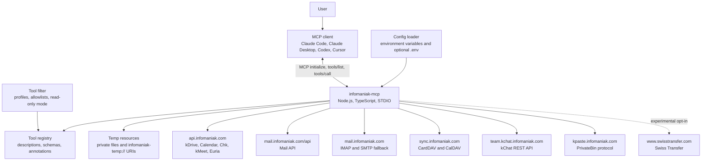
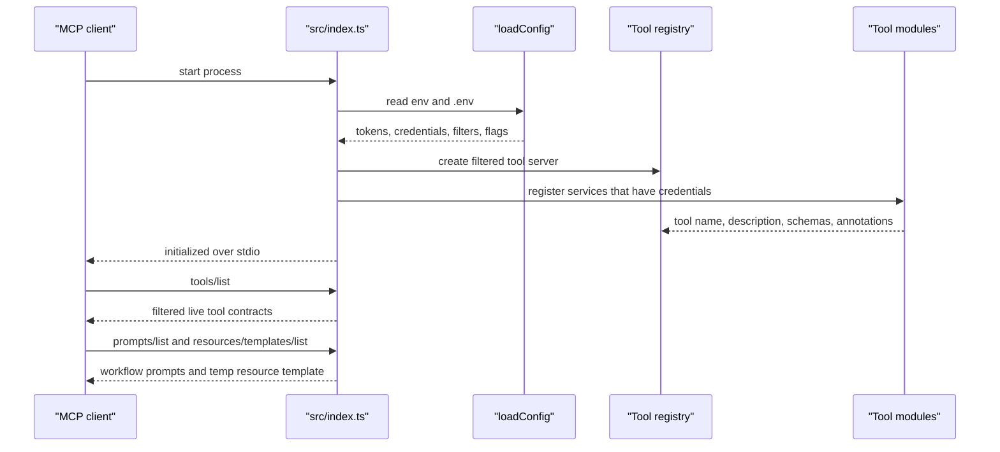
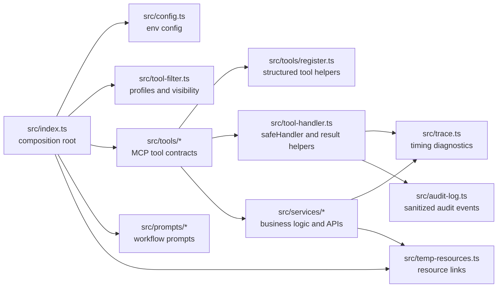
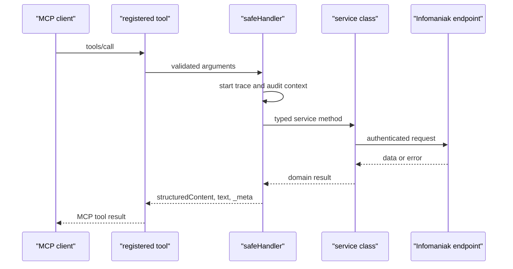
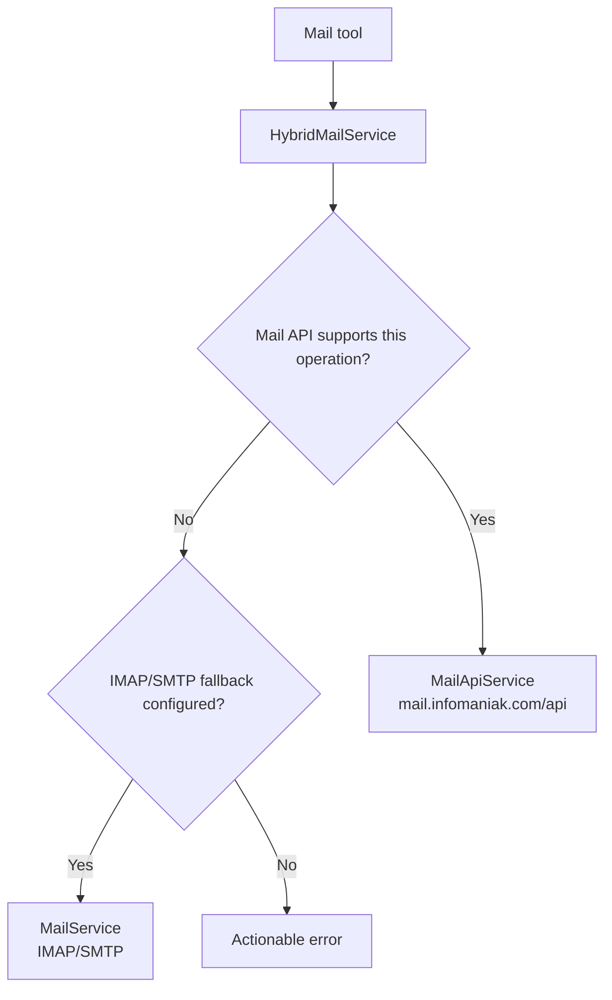
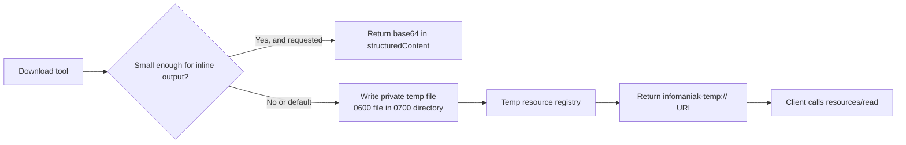
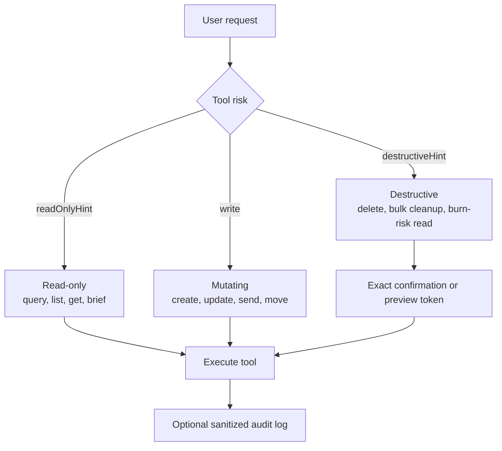
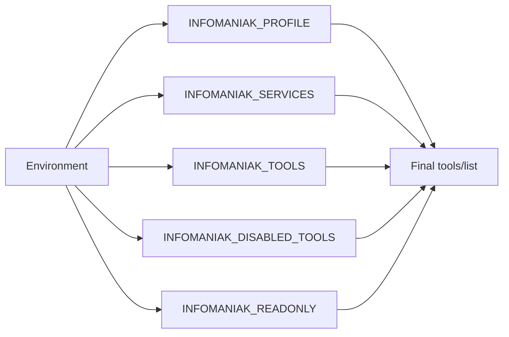

# Architecture

This document describes the 1.0 runtime architecture for `@henrikogard/infomaniak-mcp`.

The server is a local STDIO MCP server. It is intentionally user-scoped: it helps one Infomaniak user work with their own kSuite data. Tenant administration, organization-wide mail security, domains, hosting, and governance workflows belong in the admin-focused companion project, [`infomaniak-admin-mcp`](https://github.com/henrikogaard/infomaniak-admin-mcp).

## Runtime Topology

## Startup And Discovery

The server advertises only tools that can work with the configured credentials and feature flags.

The important design rule: README examples are not the source of truth for the model. The live MCP `tools/list` response is. The `infomaniak_help` tool summarizes that live response into service groups, top-level arguments, risk labels, usage hints, next-tool suggestions, and confirmation hints.

## Internal Modules

## Tool Call Lifecycle

Error handling is centralized through `safeHandler`. Tool handlers return `isError` MCP results instead of crashing the server process.

## Mail Routing

Mail uses a hybrid router. The Mail API is preferred for fast metadata, query, attachment, draft, folder, spam, filter, and single-message mutation paths. IMAP/SMTP remains the compatibility fallback for full-body search and unsupported or failed API operations.

Mailbox and folder discovery are cached with TTLs and in-flight request coalescing. Mutations that can change folder contents or folder discovery invalidate affected caches.

## Large Output And Resource Links

Large binary payloads should not be placed directly in MCP JSON responses. kDrive downloads and mail attachments can be saved to private temp files and returned as MCP resource links.

Temp resources are local and private. They are pruned by expiry and by registry size.

## Safety Model

Safety controls include:

- MCP annotations for read-only, mutating, and destructive tools.
- Exact confirmation phrases for destructive operations.
- Preview-before-confirm flows for sender cleanup and spam cleanup.
- Optional `STRICT_CONFIRM_EXTERNAL_SEND=1` for external send tools.
- Optional `INFOMANIAK_READONLY=1` to hide mutating tools from `tools/list`.
- Optional audit logging with redaction of secrets, bodies, confirmations, tokens, URL fragments, and email local parts.
- `_meta["infomaniak/untrustedContent"]` hints for mail, calendar, contact, and kChat user-controlled fields.

## Tool Surface Controls

Filtering changes only what the MCP client sees. It is not a substitute for least-privilege Infomaniak tokens or separate DAV/mail credentials.

## Launch Defaults

For 1.0:

- Stable user-facing tools are enabled by credentials.
- Swiss Transfer remains opt-in experimental.
- `infomaniak_help`, prompts, structured output, and annotations are part of the default experience.
- The package ships `dist`, `README.md`, `LICENSE`, `docs`, and `scripts`.
- Release verification is handled by `npm run verify:release`.
